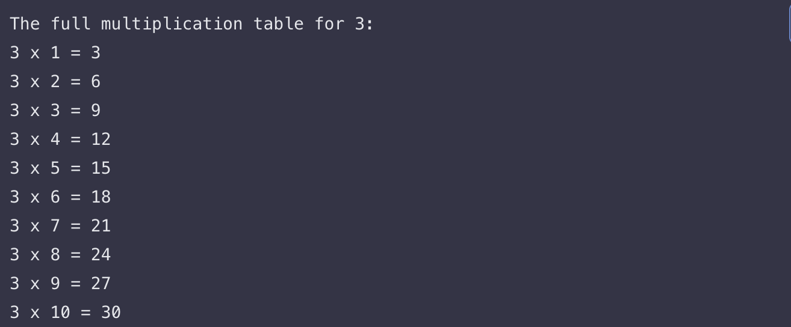
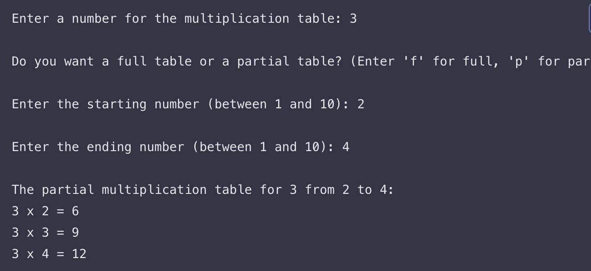
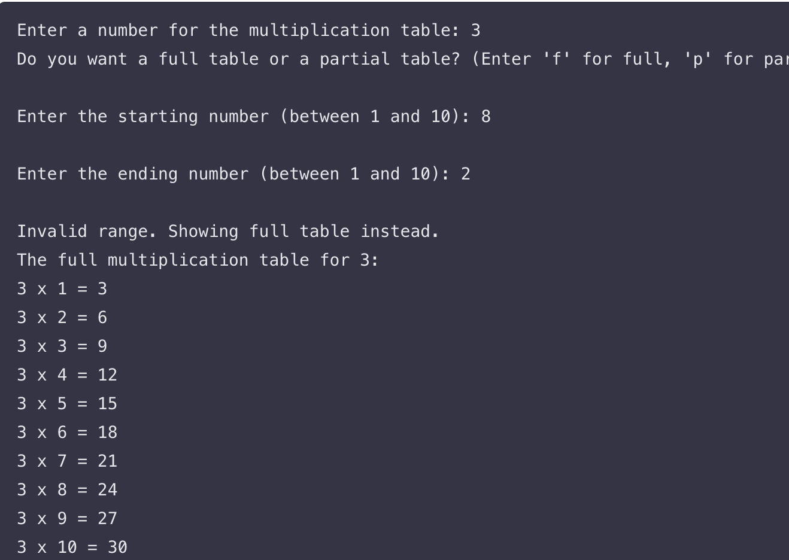
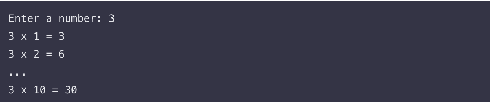

# Bash-Script-for-creating-a-multiplication-table-

Project title
Bash Script to Produce a Multiplication Table on Demand

Objective
Develop a Bash program that prints a multiplication table for a number supplied by the user. The script must support two presentation modes: a complete table covering multipliers 1 through 10, or a partial table confined to a user-defined start and end multiplier. This task is deliberately designed to solidify your comfort with for-loops, conditional branching, user input capture, basic validation, and clean terminal formatting in Bash.

Project overview
When executed, the script asks the user for a single integer that will serve as the base of the multiplication table. Immediately afterward, it requests a choice between two display options: show the full table from 1 to 10, or show only a segment. If the segment option is chosen, the user is prompted for two additional numbers that define the beginning and end of the multiplier range. The program then validates those numbers and proceeds to print each multiplication statement on its own line in a consistent, readable style. If the partial range is invalid, the script informs the user and gracefully falls back to the full table.

What must be implemented in exact terms

1. Capture the base number. The first prompt obtains the integer whose products you will display. Store this in a variable for all subsequent calculations.
2. Ask for table mode. The second interaction determines whether the output should be the complete 1–10 table or a limited slice. Collect a concise flag (for instance, f for full or p for partial).
3. Gather partial bounds when needed. If the user chose the partial option, ask for a start multiplier and an end multiplier. These two inputs strictly delimit the lines to be displayed.
4. Use loops to generate output. The core of the program is a loop that visits each multiplier in the required sequence and prints a single formatted result per iteration.
5. Apply branching logic. Choose the appropriate loop bounds based on the selected mode. For full mode, your loop runs 1 to 10; for partial mode, your loop runs from start to end inclusively.
6. Validate inputs. If the user supplies a partial range outside 1–10 or in reverse order (start greater than end), declare the range invalid and default to printing the complete 1–10 table. This behavior is mandatory per the brief.
7. Keep the output clean. Each line should read naturally, for example “7 x 3 = 21”, with uniform spacing and line breaks. Formatting must mirror the provided examples so your results are effortless to scan.
8. Comment for clarity. Annotate the script so that a reader can quickly see where each requirement is fulfilled and which loop form is being demonstrated.

End-to-end interaction flow

1. Prompt for the number whose table should be shown and store it.
2. Prompt for the mode of display: full or partial. Accept a simple letter or word that is easy to type.
3. If the mode is partial, prompt for both the starting multiplier and the ending multiplier, and remind the user that valid values are 1 through 10.
4. Validate the partial inputs: confirm that both numbers are in the 1–10 window and that the start is less than or equal to the end. If these checks fail, display a short message explaining the issue and switch to printing the full table.
5. Execute the printing loop. In full mode, iterate from 1 to 10. In partial mode, iterate from start to end. On each cycle, compute base × multiplier and print the equation and result in a single tidy line.
6. Conclude with a clear, coherent list of lines that match the examples in order and formatting.

Loop techniques required and where they appear
Part 1: List-form for loop
The assignment requires demonstrating the list-style loop first. In this section, you implement the for … in … pattern to step through your multiplier sequence. For a full table, enumerate 1 2 3 … 10; for a partial table, enumerate the numeric span beginning at the user’s start and ending at the user’s end. With each pass, calculate the product and echo a line that matches the established format. This part proves that you can produce the required output using the concise list-form loop syntax.

Part 2: C-style for loop
Repeat the table generation using the C-style construct for (( init; test; update )). The logic is identical—the only change is the loop syntax. Initialize your counter to 1 (or to the user’s start), continue while it remains within bounds (≤ 10 or ≤ end), and increment by one per iteration. This section lets you compare both looping styles side by side while yielding identical results.

Validation behaviors and expected outputs
— Full table example: After entering a base number (for example, 3) and choosing the full option, the script prints ten lines from “3 x 1 = 3” through “3 x 10 = 30”. This confirms correct sequencing and arithmetic.
— Partial table example: With base 3 and bounds 2 to 4, the program prints exactly “3 x 2 = 6”, “3 x 3 = 9”, and “3 x 4 = 12”, nothing more and nothing less.
— Invalid range handling: If the user supplies an out-of-bounds value (below 1 or above 10) or reverses the range (e.g., start 8 and end 2), the script explains that the range is invalid and reverts to the complete 1–10 table for the same base number. No crash, no partial output—just a clear fallback, per spec.

Quality criteria that will be used to assess your work

1. Correctness and functionality (20%): The script must compute and display accurate products and honor the chosen mode.
2. Loop implementation (20%): Both loop styles—list-form and C-style—are present and used properly to drive iteration.
3. Code readability (20%): The program is structured in a straightforward way with sensible variable names and comments that map to the brief’s parts.
4. Validation and error treatment (20%): Out-of-range and ill-ordered partial inputs are detected and handled exactly as defined, with an explicit message and a full-table fallback.
5. User-facing experience (20%): Prompts are easy to understand and outputs are evenly formatted and consistent with the examples.

Learning outcomes (what this task builds)
— Mastery of user input capture in Bash and reuse of variables in arithmetic.
— Practical understanding of when and how to use the list-form for loop versus the C-style for loop while achieving identical outcomes.
— Habit-building around automating repeated output patterns using loops instead of manual echo statements.
— Discipline in producing clean, readable terminal output and in documenting code sections so another engineer can follow the logic immediately.

What I verified during execution
— Full-mode behavior prints exactly ten lines with correct products for the supplied base number.
— Partial-mode behavior respects the provided bounds and shows only the requested slice of the table.
— Invalid partial bounds result in a clear explanation and an automatic switch to the full 1–10 table, without errors or confusing output.

Feedback request
Kindly review the clarity of my prompts, the symmetry of outputs across the two loop implementations, and the fidelity of my formatting relative to the example lines. I exceeded the bare minimum by extensively testing multiple valid and invalid input combinations for both loop styles to confirm identical behavior and to ensure that boundary checks (lower edge 1, upper edge 10, and reversed ranges) behave exactly as specified. I also refined inline comments to map each section back to the brief (which part handles list-form, which part handles C-style, and where validation occurs) so a reviewer can instantly navigate the script. Any suggestions for making the user experience even clearer—while preserving the exact scope—are welcome.

Conclusion
This work delivers a Bash script that does precisely what the brief requires: it collects a base number, offers a full or partial display mode, optionally accepts range boundaries, validates those boundaries, and prints a neatly formatted multiplication table. It demonstrates both mandatory loop forms and enforces the specified fallback behavior for invalid ranges. The implementation stops exactly at the point the specification ends—no extra features beyond the documented requirements. The images below depict this flow and the expected outputs, numbered to match the VS Code pattern: 
 
 
 
 